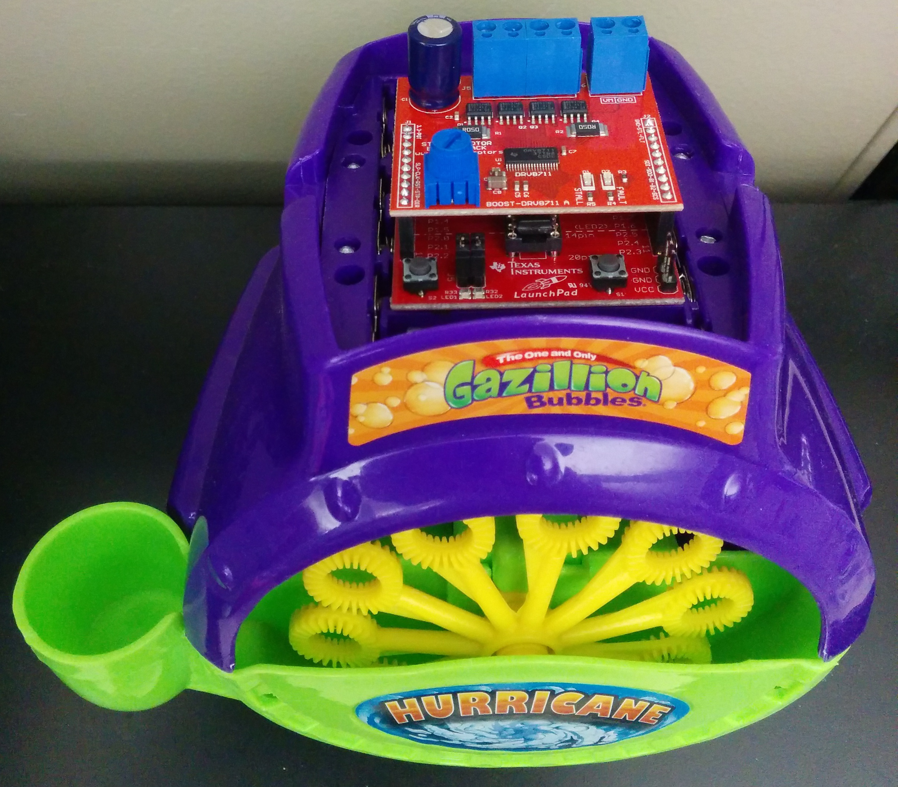

I've had a fascination with bubbles for quite some time now. Especially the large bigger-than-a-person sized ones. I purchased a cheap bubble machine on amazon.com to bring my shopping cart total to $35 for free shipping. After receiving (and playing with) the bubble machine, I wanted to make it "smart"-er. Thus began the onslaught of ideas from making it WiFi-connected to be controlled with a mobile phone, to 3D printing custom bubble-wands, to increasing the rate of bubble output, to mounting the connected machine on an autonomous quad-copter.

For prototyping, I began with an MSP430-WiFi solution and some spare hobby motors. A friend of mine recently bought his own 3D printer, so I went to designing custom wands of differnt shapes and sizes.

